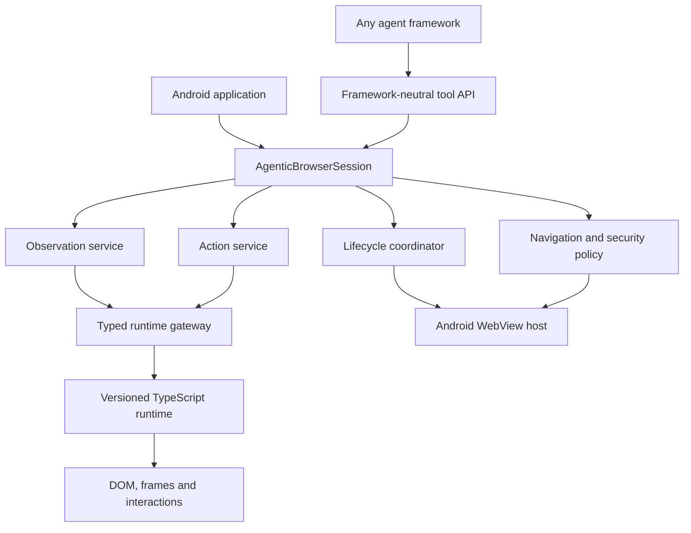
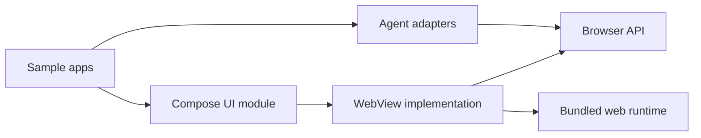

# Agentic WebView SDK: Architecture and Refactoring Plan

## 1. Document Status

- **Status:** Architecture and code migration implemented; acceptance verification deferred at owner request
- **Target:** `0.3.0` development line
- **Compatibility policy:** No backward-compatibility layer
- **Implementation policy:** Replace prototype architecture cleanly; do not preserve obsolete APIs merely to reduce migration work
- **Primary goal:** Build a robust, framework-neutral Android WebView automation SDK that any agent system can integrate through typed APIs or generic tool definitions

The breaking module split, typed API, versioned runtime protocol, semantic observation/action engines, Android host, Compose lifecycle binding, generic tool profiles, Koog and JSON-RPC adapters, deterministic fixtures, documentation rewrite, and release workflow described here were applied on 2026-09-01. The former prototype modules and compatibility paths were deleted. Dependency-free architecture, documentation-link, version-alignment, runtime-size, and artifact-size gates are in place. Gradle/emulator, website dependency-install, reference-device performance, and publication verification remain for the requested later verification pass.

This document is the implementation blueprint for replacing the current prototype with a production-oriented architecture. It intentionally permits breaking package names, class names, configuration, models, runtime protocol, module layout, and integration patterns.

---

## 2. Product Goal

Agentic WebView should provide a dependable browsing runtime inside an Android application. It must let an arbitrary agent:

1. Navigate a WebView under an explicit security policy.
2. Observe page content through a compact but semantically useful model.
3. Reference elements with stable, document-scoped handles.
4. Execute browser actions with deterministic outcomes.
5. Receive structured errors, lifecycle events, and diagnostics.
6. Integrate without depending on a particular LLM provider or agent framework.

The SDK is a browser execution and perception layer. It is not responsible for:

- deciding an agent's objective;
- running an LLM inference loop;
- storing provider API keys;
- deciding when an agent task is complete;
- implementing framework-specific chat UI;
- silently bypassing website security controls.

---

## 3. Current Prototype Assessment

The prototype demonstrates that an Android WebView, an injected TypeScript runtime, native screenshots, and agent-oriented DOM serialization can work together. Those concepts should remain. The current implementation, however, combines too many responsibilities and contains behavior that cannot be made dependable through isolated patches.

### 3.1 Architectural problems

1. `AgenticWebController` owns lifecycle, serialization, retries, action routing, JavaScript evaluation, promise tracking, screenshots, page settlement, state publication, and WebView attachment.
2. `AgenticWebView` owns configuration, navigation policy, script injection, bridge security, page state, popup handling, dialog behavior, crash handling, and client installation.
3. Controller and WebView can receive different configuration instances.
4. The public API exposes internal JSON as strings.
5. Agent orchestration commands such as `Done` and `Wait` are mixed with browser commands.
6. Compose is packaged with the main Android library, forcing unnecessary UI dependencies on View-only consumers.
7. The sample application's Koog integration is the only demonstrated agent adapter, making the SDK appear coupled to a particular framework.

### 3.2 Runtime correctness problems

1. Interactive element IDs are regenerated from zero for every capture and are not stable across insertions or reordering.
2. `elementHash.ts` is not connected to the active element identity path.
3. `waitForStability()` returns a JavaScript Promise, but Kotlin reads the immediate `evaluateJavascript` value as if it were a resolved Boolean.
4. The scroll promise may resolve before Kotlin registers the corresponding deferred request.
5. Runtime configuration is forwarded after parser, mutation observer, and anti-detection initialization. Some configuration therefore has no effect.
6. JavaScript errors are frequently converted into `false`, empty strings, or empty arrays, which hides the failure cause.
7. Several Kotlin action handlers return success after calling a helper that discards JavaScript evaluation errors.
8. All failed actions use a shared retry policy, even when repeating the action can create duplicate side effects.
9. `InputText.clearFirst` is not honored.
10. Synthetic keyboard events do not guarantee browser default actions such as form submission, text selection, or focus traversal.

### 3.3 Observation problems

1. The exported structure is called an accessibility tree but primarily contains interactive elements.
2. Headings, paragraphs, status messages, table content, and other non-interactive information can be absent from the agent's observation.
3. `accessibilityTree` is a JSON document stored inside a Kotlin `String`.
4. The tree is built before `maxDomElements` limits output, so the configured limit does not bound traversal cost.
5. The tree is flattened and does not provide a reliable parent/frame relationship.
6. The `selectorMap` often maps an index to the same string representation of that index and adds little value.
7. Element change detection is keyed by regenerated highlight indexes rather than actual identity.
8. Attribute collection and screenshot output lack a unified privacy and redaction policy.

### 3.4 Frame and coordinate problems

1. Frame element IDs can collide with top-document IDs.
2. Previously merged subframe data is cleared at the start of capture.
3. Cross-frame request behavior is not integrated into the capture pipeline.
4. Elements discovered inside a frame can be removed from the element map because top-document containment checks fail.
5. Frame-local coordinates are not translated through ancestor frames.
6. Cross-origin frame capabilities and limitations are not clearly modeled.
7. The current coordinate test does not validate the complete CSS-pixel-to-WebView-coordinate transformation.

### 3.5 Lifecycle and resource problems

1. Page settlement is approximated by a debounce timer after progress or DOM mutation events.
2. `onPageFinished` is treated as interactive even though modern applications can continue initializing or navigate through SPA transitions.
3. DOM mutations can initiate repeated full captures and screenshot work.
4. Capture operations are serialized, but mutation-driven capture requests can still accumulate.
5. Renderer recovery is reported without recreating or proving recovery of the WebView runtime.
6. Pending operations are not governed by an explicit document/navigation generation.
7. Motion events are not recycled.
8. Screenshot capture assumes the WebView context is directly an `Activity`.
9. Base64 screenshots are embedded in the observation model, causing avoidable memory copies.

### 3.6 Security problems

1. A session token available to page-context JavaScript is not a meaningful secret or security boundary.
2. Bridge input must be considered untrusted because arbitrary page scripts share the JavaScript environment.
3. Denied-host suffix matching can accept unrelated domains with matching endings.
4. URL policy does not have an explicit definition for exact hosts, subdomains, redirects, popups, external schemes, downloads, or user-approved exceptions.
5. JavaScript dialogs are automatically accepted.
6. Anti-detection behavior is enabled by default and changes page globals and Shadow DOM behavior.
7. Tool output does not explicitly separate untrusted webpage content from trusted agent instructions.

### 3.7 Quality-gate problems

1. Jest currently covers only part of the DOM parser.
2. TypeScript strict checking fails even though esbuild succeeds.
3. CI builds the TypeScript bundle but does not run Jest or `tsc --noEmit`.
4. CI does not run JVM unit tests or Android instrumented tests.
5. Several Android tests check only that an operation returned `Success`, not that the browser state changed correctly.
6. Some tests assume hard-coded element IDs.
7. There are no enforced latency, allocation, payload-size, or mutation-storm budgets.
8. Version values are duplicated across Gradle, Kotlin, npm, and the sample application.

---

## 4. Refactoring Principles

### 4.1 One owner per responsibility

Every major responsibility must have one authoritative component:

- session lifecycle → `AgenticBrowserSession`;
- Android WebView ownership → WebView host;
- runtime communication → runtime gateway;
- page readiness → page lifecycle coordinator;
- observations → observation service;
- actions → action service;
- screenshots → screenshot provider;
- navigation security → navigation policy;
- tool exposure → framework-neutral tool provider.

### 4.2 Typed boundaries

JSON is allowed only at process/runtime boundaries. Public Kotlin APIs must expose typed models. TypeScript runtime APIs must expose typed request and response structures. Parsing and validation happen once at the gateway.

### 4.3 Explicit failure

No runtime error should silently become an empty result. Every operation must end with one of:

- typed success;
- typed failure;
- cancellation;
- timeout.

### 4.4 Document-scoped identity

An element reference is valid only for a specific document and frame. A stale reference must fail explicitly. The SDK must never silently apply an old reference to a different element.

### 4.5 Verified action outcomes

Action dispatch and action success are different concepts. Successful dispatch does not imply that the page accepted the action. Action results must report whether the expected effect was observed.

### 4.6 Framework neutrality

The core SDK must not depend on Koog, OpenAI, Anthropic, LangChain, or another agent framework. Agent adapters translate framework-neutral tool definitions.

### 4.7 Secure defaults

- Do not automatically accept dialogs.
- Do not enable anti-detection by default.
- Do not expose unnecessary native bridge methods.
- Do not treat webpage content as trusted instructions.
- Do not log sensitive page data by default.

### 4.8 Bounded work

Every potentially expensive operation must have a limit:

- DOM traversal nodes;
- traversal time;
- observation bytes;
- text per node;
- bridge message size;
- screenshot dimensions;
- queued events;
- pending requests;
- action duration.

---

## 5. Target System Architecture



### 5.1 Dependency direction

Dependencies point inward toward contracts:



The API module must not depend on Android UI, Compose, an LLM SDK, or the TypeScript build system.

---

## 6. Proposed Repository and Module Layout

```text
agentic-webview/
├── browser-api/
│   └── src/main/kotlin/dev/shantoislam/agenticwebview/api/
├── browser-webview/
│   └── src/main/kotlin/dev/shantoislam/agenticwebview/webview/
├── browser-compose/
│   └── src/main/kotlin/dev/shantoislam/agenticwebview/compose/
├── agent-tools/
│   └── src/main/kotlin/dev/shantoislam/agenticwebview/tools/
├── integrations/
│   ├── koog/
│   └── jsonrpc/
├── samples/
│   └── android/
├── web-runtime/
│   ├── src/
│   ├── test/
│   └── package.json
├── test-pages/
│   ├── fixtures/
│   └── server/
├── docs/
│   ├── architecture-refactoring-plan.md
│   ├── concepts/
│   ├── guides/
│   └── reference/
├── gradle/
│   └── publishing.gradle.kts
├── scripts/
│   ├── validate-architecture.mjs
│   ├── validate-doc-links.mjs
│   └── check-artifact-sizes.mjs
└── .github/workflows/
```

### 6.1 `browser-api`

Pure Kotlin contracts:

- `AgenticBrowserSession` interface;
- browser configuration and validated value objects;
- command hierarchy;
- observation hierarchy;
- page/frame/element identifiers;
- typed result and error hierarchy;
- browser events;
- diagnostics contracts;
- screenshot metadata and encoding types.

### 6.2 `browser-webview`

Android implementation:

- WebView creation and ownership;
- WebView clients;
- runtime installation;
- runtime gateway;
- lifecycle coordinator;
- action service;
- observation service;
- screenshot provider;
- navigation policy enforcement;
- popup, download, file, dialog, permission, and crash events.

### 6.3 `browser-compose`

Optional integration:

- `AgenticBrowserView` composable;
- lifecycle binding;
- state restoration policy;
- no Material components;
- no application-specific UI.

### 6.4 `agent-tools`

Agent-independent tool layer:

- `AgentToolDefinition`;
- JSON Schema input/output contracts;
- generic tool dispatcher;
- consistent serialization of observations and errors;
- configurable tool profiles such as minimal, standard, and advanced.

### 6.5 `integrations/koog`

Optional translation between generic tool definitions and Koog's tool interfaces. Koog must not appear in the core dependency graph.

### 6.6 `web-runtime`

The page-side runtime:

- protocol entry point;
- document and frame identity;
- DOM observation;
- stable element registry;
- semantic extraction;
- action preparation and execution;
- mutation revision tracking;
- structured errors;
- runtime diagnostics.

---

## 7. Public API Design

Names below are directional. Exact naming can be finalized before Phase 2 implementation.

### 7.1 Session façade

```kotlin
interface AgenticBrowserSession : AutoCloseable {
    val state: StateFlow<BrowserSessionState>
    val events: Flow<BrowserEvent>

    suspend fun navigate(request: NavigationRequest): BrowserResult<NavigationReceipt>
    suspend fun observe(options: ObservationOptions = ObservationOptions()): BrowserResult<BrowserObservation>
    suspend fun execute(command: BrowserCommand): BrowserResult<CommandReceipt>
    suspend fun await(condition: WaitCondition): BrowserResult<WaitReceipt>

    override fun close()
}
```

The session owns one effective configuration. Consumers must not configure the controller and WebView separately.

### 7.2 Identifiers

Use distinct value types instead of raw strings:

```kotlin
@JvmInline value class DocumentId(val value: String)
@JvmInline value class FrameId(val value: String)
@JvmInline value class ElementId(val value: String)
@JvmInline value class ObservationRevision(val value: Long)

data class ElementRef(
    val documentId: DocumentId,
    val frameId: FrameId,
    val elementId: ElementId,
    val observedAtRevision: ObservationRevision,
)
```

### 7.3 Observation model

```kotlin
data class BrowserObservation(
    val id: String,
    val capturedAtEpochMs: Long,
    val document: PageDocument,
    val revision: ObservationRevision,
    val viewport: BrowserViewport,
    val frames: List<PageFrame>,
    val nodes: List<PageNode>,
    val compactText: String,
    val screenshot: BrowserScreenshot?,
    val truncation: ObservationTruncation?,
    val warnings: List<ObservationWarning>,
    val metrics: ObservationMetrics,
)
```

`PageNode` must distinguish semantic and actionable data:

- semantic role;
- readable text;
- accessible name and description;
- state such as checked, selected, expanded, disabled, readonly;
- hierarchy and frame membership;
- bounds and visibility;
- optional `ElementRef` when actionable;
- redacted attributes selected by policy.

### 7.4 Commands

```kotlin
sealed interface BrowserCommand {
    data class Click(val target: ElementRef, val button: PointerButton = PointerButton.PRIMARY) : BrowserCommand
    data class LongPress(val target: ElementRef, val durationMs: Long) : BrowserCommand
    data class TypeText(val target: ElementRef, val text: String, val mode: TextInputMode) : BrowserCommand
    data class SelectOption(val target: ElementRef, val option: SelectOptionMatcher) : BrowserCommand
    data class PressKeys(val chord: KeyChord) : BrowserCommand
    data class Scroll(val target: ScrollTarget, val delta: ScrollDelta) : BrowserCommand
    data class ScrollIntoView(val target: ElementRef, val alignment: ScrollAlignment) : BrowserCommand
}
```

Navigation should be a separate session method or separate command category because it changes document identity and invalidates pending element references.

Remove from the browser command hierarchy:

- `Done`;
- arbitrary `Wait(duration)`;
- `GetDropdownOptions` as a state-mutating command.

Dropdown options belong in observation/detail queries. Waiting belongs in an explicit condition API.

### 7.5 Results and errors

```kotlin
sealed interface BrowserResult<out T> {
    data class Success<T>(val value: T, val diagnostics: OperationDiagnostics) : BrowserResult<T>
    data class Failure(val error: BrowserError, val diagnostics: OperationDiagnostics) : BrowserResult<Nothing>
}
```

Error categories:

- session not attached/closed;
- invalid configuration;
- navigation blocked;
- navigation failed;
- page not ready;
- stale element reference;
- element not found;
- element not actionable;
- element occluded;
- unsupported frame;
- unsupported action;
- action rejected;
- action not verified;
- runtime unavailable;
- runtime protocol mismatch;
- runtime failure;
- malformed runtime response;
- renderer terminated;
- screenshot failure;
- timeout;
- cancellation;
- resource limit exceeded.

Errors must include safe structured context rather than requiring string parsing.

---

## 8. Runtime Protocol

### 8.1 Protocol requirements

The Kotlin-to-TypeScript boundary will use a single versioned protocol rather than calling many global JavaScript functions directly.

Every request contains:

```json
{
  "protocolVersion": 1,
  "sessionId": "...",
  "documentId": "...",
  "requestId": "...",
  "method": "observation.capture",
  "payload": {}
}
```

Every response contains:

```json
{
  "protocolVersion": 1,
  "sessionId": "...",
  "documentId": "...",
  "requestId": "...",
  "status": "success",
  "result": {}
}
```

or:

```json
{
  "protocolVersion": 1,
  "sessionId": "...",
  "documentId": "...",
  "requestId": "...",
  "status": "error",
  "error": {
    "code": "STALE_ELEMENT",
    "message": "Element belongs to an earlier document revision",
    "details": {}
  }
}
```

### 8.2 Gateway behavior

The Android runtime gateway must:

1. Create and register a pending request before dispatching JavaScript.
2. Enforce a maximum pending-request count.
3. Validate protocol version, session ID, document ID, request ID, method, payload size, and response shape.
4. Complete each request at most once.
5. Cancel all document-bound requests when navigation begins.
6. Cancel all requests when the session closes or renderer terminates.
7. Preserve timeout and cancellation as distinct outcomes.
8. Emit request timing diagnostics without logging sensitive payloads.

### 8.3 Runtime initialization

Configuration must be provided before runtime components initialize. Initialization order:

1. generate session/document identity;
2. inject bootstrap;
3. parse and validate configuration;
4. initialize frame registry;
5. initialize element registry;
6. initialize observation engine;
7. initialize mutation revision tracking;
8. publish runtime-ready event.

No observer or anti-detection behavior may initialize using default values before configuration arrives.

### 8.4 Error handling

The TypeScript runtime must not use broad catches that return false or empty arrays. A catch must either:

- translate a known error into a protocol error code;
- report an internal runtime error with safe diagnostic information;
- rethrow during tests and development builds.

---

## 9. Stable Element Identity

### 9.1 Identity guarantees

Within one document:

- an element keeps the same `ElementId` while the same DOM `Element` instance remains connected;
- inserting unrelated siblings does not renumber existing elements;
- removing an element invalidates its handle;
- replacing an element creates a new ID, even when attributes are identical;
- navigation creates a new `DocumentId` and invalidates every old element reference;
- frame navigation invalidates element references belonging to that frame.

### 9.2 Runtime implementation

Use a document-scoped registry:

- `WeakMap<Element, ElementId>` for element-to-ID lookup;
- `Map<ElementId, WeakRef<Element>>` where supported, with a bounded fallback strategy;
- monotonic IDs scoped by document and frame;
- mutation-driven cleanup;
- no `data-agent-id` DOM mutation unless a debugging mode explicitly requests it.

Hashes and selectors may help reacquire a semantically similar element, but they must not silently redefine identity. Reacquisition must be an explicit optional strategy and must report that it occurred.

### 9.3 Stale reference handling

Before executing an element command, verify:

1. document ID matches;
2. frame ID matches an active frame;
3. element ID exists;
4. referenced element is connected;
5. element remains actionable for the requested command.

Failure returns `StaleElementReference` or a more specific error. It must not fall back to another element automatically.

---

## 10. Semantic Observation Engine

### 10.1 Observation goals

The agent needs enough information to understand and operate the current page without receiving the entire raw DOM.

Include:

- document title and URL;
- headings and landmark structure;
- paragraphs and meaningful visible text;
- links, buttons, inputs, selects, controls, tabs, menus, and dialogs;
- lists and tables with bounded content;
- alerts, validation messages, and live-region content;
- actionable state and labels;
- frame boundaries;
- scroll position and page extent.

Exclude by default:

- scripts and styles;
- invisible tracking elements;
- duplicated descendant text;
- secrets and password values;
- excessive decorative content;
- unbounded hidden/offscreen DOM.

### 10.2 Traversal budgets

Observation configuration should include:

- maximum visited DOM nodes;
- maximum emitted semantic nodes;
- maximum total text characters;
- maximum text characters per node;
- maximum traversal duration;
- viewport expansion policy;
- maximum frame depth;
- maximum shadow depth;
- screenshot policy.

If a budget is reached, return a valid partial observation with a structured truncation reason.

### 10.3 Compact serialization

Generate LLM-oriented compact text from the typed observation, not directly from DOM traversal. This guarantees that structured consumers and text-only agents receive the same underlying information.

The serializer must:

- escape delimiters consistently;
- distinguish page content from trusted tool instructions;
- cap and normalize text;
- avoid repeating accessible names and text;
- include frame and hierarchy markers only where useful;
- expose stable element references in a short agent-facing form;
- include observation/document revision metadata.

### 10.4 Privacy and redaction

Create `ObservationRedactionPolicy` with defaults for:

- password inputs;
- payment-card-like values;
- authentication tokens;
- configurable attribute names;
- configurable CSS selectors;
- optional screenshot masking.

The SDK must avoid logging raw observations and action text unless explicitly enabled in a development-only diagnostic policy.

---

## 11. Frame and Shadow DOM Architecture

### 11.1 Frame model

Every frame has:

- `FrameId`;
- parent frame ID;
- document ID;
- URL and origin when available;
- frame-local viewport;
- transform/offset to its parent;
- capability status.

Capability states should include:

- fully observable and actionable;
- observable but action-limited;
- inaccessible cross-origin frame;
- sandbox-restricted frame;
- detached frame.

### 11.2 Coordinate transformation

Coordinates must be transformed in one authoritative component:

1. element client rect in frame CSS coordinates;
2. frame offset and border transformation through every ancestor;
3. visual viewport offset and zoom;
4. WebView content scale;
5. final WebView-local Android coordinates.

The implementation must be verified on multiple Android densities, page zoom levels, scrolled frames, nested frames, and WebView sizes.

### 11.3 Shadow DOM

- Traverse open Shadow DOM roots.
- Preserve host/shadow boundary metadata.
- Do not force closed roots to open by default.
- If an experimental instrumentation policy changes `attachShadow`, enable it before page scripts and label the session as behavior-modifying.

---

## 12. Action Engine

### 12.1 Action pipeline

Every element action follows:

1. validate session and document;
2. resolve element reference;
3. validate action compatibility;
4. inspect visibility and occlusion;
5. scroll and wait for stable geometry when necessary;
6. execute using the configured strategy;
7. wait for an action-specific postcondition;
8. return a receipt with verification status and diagnostics.

### 12.2 Execution strategies

Support explicit strategies rather than hidden behavior:

- native pointer input;
- DOM/native-setter input for framework compatibility;
- Android key input;
- JavaScript-assisted fallback when allowed.

The default strategy can vary by action, but the receipt must report which strategy executed.

### 12.3 Retry policy

Do not retry every command uniformly.

Safe retry candidates:

- observation capture;
- element resolution before dispatch;
- scrolling to an unchanged target;
- idempotent state queries.

Unsafe automatic retry candidates:

- click;
- long press;
- text entry;
- form submission;
- navigation with possible side effects;
- JavaScript-triggered actions.

For unsafe commands, retry preparation only. Once dispatch occurs, return an unverified or ambiguous result instead of dispatching again.

### 12.4 Postcondition verification

Examples:

- click: focus change, checked/expanded state, navigation, DOM revision, or target-specific event evidence;
- type text: resulting control value equals expected value according to input mode;
- select: selected option/value matches;
- scroll: scroll position changed or target entered the requested viewport region;
- navigation: document ID changed and target lifecycle reached the configured readiness condition.

### 12.5 Input behavior

`TextInputMode` should include:

- replace all;
- append;
- insert at current selection;
- clear.

Input handling must support:

- standard inputs;
- textareas;
- contenteditable elements;
- React/Vue/Angular-style controlled inputs;
- composition/IME constraints where feasible;
- explicit unsupported results for elements the SDK cannot safely edit.

---

## 13. Page Lifecycle and Readiness

### 13.1 State machine

Replace the mutable enum and settlement timer with an event-driven state machine:

```text
Detached
  -> Attached
  -> Navigating
  -> DocumentCreated
  -> RuntimeInitializing
  -> Interactive
  -> Stabilizing
  -> Ready
  -> Failed | RendererTerminated | Closed
```

SPA route changes and frame navigations produce events without pretending every mutation is a full navigation.

### 13.2 Readiness policy

Create a configurable readiness policy composed from:

- main document readiness;
- runtime ready handshake;
- optional progress threshold;
- DOM quiet window;
- optional network quiet signal where observable;
- maximum wait timeout;
- consumer-provided condition.

Readiness is not permanent. A ready page can become active again after significant mutations, navigation, or document replacement.

### 13.3 Mutation handling

Mutation events should update a monotonic document revision. Do not automatically capture full state and screenshots for every event.

Use:

- conflated revision events;
- bounded event buffers;
- consumer-controlled observation;
- optional debounced auto-observation without screenshots;
- cancellation of obsolete capture work.

---

## 14. Android WebView Host

### 14.1 Ownership

Provide a factory or builder that creates a WebView host and session from one validated configuration. Avoid requiring consumers to manually create two objects with matching settings.

Possible direction:

```kotlin
val browser = AgenticWebView.create(
    context = context,
    configuration = configuration,
)

val session = browser.session
val view = browser.view
```

Compose should remember and dispose the same host deterministically.

### 14.2 WebView clients

Consumers frequently need their own `WebViewClient` and `WebChromeClient`. Do not make safe extension require replacing SDK clients.

Provide typed delegates/interceptors for:

- navigation decisions;
- page lifecycle events;
- dialogs;
- permissions;
- file chooser;
- downloads;
- popups;
- console diagnostics;
- renderer termination.

### 14.3 Destruction

Closing must be idempotent and perform:

- pending request cancellation;
- coroutine scope cancellation;
- bridge removal when possible;
- listener removal;
- observer shutdown;
- screenshot worker shutdown;
- bitmap release;
- WebView history/cache policy as configured;
- WebView destruction when SDK-owned.

---

## 15. Navigation and Security Policy

### 15.1 URL policy

Represent rules explicitly:

```kotlin
sealed interface HostRule {
    data class Exact(val host: String) : HostRule
    data class DomainAndSubdomains(val domain: String) : HostRule
}
```

Normalize:

- scheme;
- case;
- international domain names;
- trailing dot;
- default ports;
- host boundaries.

`DomainAndSubdomains("example.com")` may match `example.com` and `a.example.com`, but never `evilexample.com`.

### 15.2 Policy decisions

Support explicit decisions for:

- main-frame navigation;
- redirects;
- subframe navigation;
- popup/new-window requests;
- external schemes;
- downloads;
- file chooser;
- geolocation/media permissions;
- JavaScript dialogs;
- SSL and safe-browsing failures.

The default response to privileged or ambiguous behavior should be reject or emit a consumer decision event, not automatic acceptance.

### 15.3 Bridge threat model

Assume page JavaScript can:

- inspect or modify page-context runtime objects;
- call exposed page-accessible bridge methods;
- produce arbitrary webpage text designed to influence an agent;
- generate high-frequency events;
- return malformed or oversized payloads.

Therefore:

- expose only a narrow message receiver;
- validate every message;
- rate-limit events;
- limit payload sizes;
- keep privileged application operations outside the bridge;
- label webpage-derived content as untrusted;
- never describe a page-visible token as authentication.

### 15.4 Anti-detection policy

Move anti-detection to an experimental opt-in configuration. Split features so consumers choose them individually:

- hide webdriver property;
- install Chrome-like globals;
- modify Shadow DOM creation.

Document that these behaviors can break pages and do not guarantee evasion of bot detection.

---

## 16. Screenshot Architecture

Create a `ScreenshotProvider` abstraction.

The default Android implementation should:

- unwrap an Activity from supported context wrappers;
- verify source rectangles;
- handle cancellation safely;
- bound bitmap dimensions and encoded bytes;
- reuse buffers only under serialized ownership;
- return encoded bytes plus MIME type and dimensions;
- avoid Base64 until an adapter explicitly needs text transport;
- optionally mask configured sensitive elements;
- expose capture duration and failure details.

Screenshots should be optional per observation request, not necessarily enabled for every capture globally.

---

## 17. Agent-Framework Integration

### 17.1 Generic tool contract

```kotlin
data class AgentToolDefinition(
    val name: String,
    val description: String,
    val inputSchema: JsonObject,
    val outputSchema: JsonObject?,
)

interface AgentToolDispatcher {
    val definitions: List<AgentToolDefinition>
    suspend fun invoke(name: String, arguments: JsonObject): AgentToolResult
}
```

### 17.2 Recommended standard tools

Keep the default tool surface small:

1. `browser_observe`
2. `browser_navigate`
3. `browser_click`
4. `browser_type_text`
5. `browser_select_option`
6. `browser_scroll`
7. `browser_press_keys`
8. `browser_go_back`
9. `browser_go_forward`
10. `browser_reload`

Advanced profiles may expose frame inspection, conditional waits, diagnostics, screenshot-only capture, or element detail queries.

### 17.3 Tool result requirements

Tool results must be machine-readable and include:

- stable error code;
- human-readable summary;
- document/revision information;
- whether a new observation is recommended;
- compact diagnostics;
- no provider-specific message formatting.

### 17.4 Adapter policy

Framework adapters must only translate:

- tool metadata;
- JSON schemas;
- tool invocation;
- tool results.

They must not reimplement browser behavior or access internal WebView classes.

---

## 18. Configuration Design

Replace the current flat configuration and duplicate builder with grouped validated configuration:

```kotlin
data class AgenticBrowserConfiguration(
    val runtime: RuntimeConfiguration = RuntimeConfiguration(),
    val observation: ObservationConfiguration = ObservationConfiguration(),
    val actions: ActionConfiguration = ActionConfiguration(),
    val navigation: NavigationPolicy = NavigationPolicy(),
    val screenshots: ScreenshotConfiguration = ScreenshotConfiguration(),
    val diagnostics: DiagnosticsConfiguration = DiagnosticsConfiguration(),
    val experimental: ExperimentalConfiguration = ExperimentalConfiguration(),
)
```

Validation examples:

- timeouts must be positive and bounded;
- screenshot quality must be `0..100`;
- screenshot dimensions must be positive;
- traversal limits must be positive;
- bridge payload limit must be below a safe maximum;
- allowed and denied rules must not conflict silently;
- experimental behavior must be explicitly enabled.

Use Kotlin default/named arguments as the primary configuration style. Add a Java-friendly builder only if needed for Java consumers, generated from or delegating to the same validated model.

---

## 19. Diagnostics and Observability

### 19.1 Structured logger

Replace a Boolean debug logger with a consumer-provided diagnostics sink:

```kotlin
fun interface BrowserDiagnosticsSink {
    fun emit(event: BrowserDiagnosticEvent)
}
```

Diagnostic events should include:

- operation/request ID;
- event category;
- duration;
- document and revision identifiers;
- safe result/error code;
- payload byte counts;
- traversal/emitted node counts;
- retry or strategy information.

### 19.2 Privacy

Diagnostic events must not contain by default:

- typed text;
- full URLs with sensitive query values;
- DOM text;
- screenshot data;
- cookies or storage;
- raw JavaScript payloads.

### 19.3 Performance budgets

Define benchmark targets before declaring the rewrite production-ready. Initial targets should cover:

- observation latency for small, medium, and large fixtures;
- action preparation latency;
- bridge round-trip time;
- compact-text size;
- peak bitmap memory;
- behavior under continuous DOM mutations;
- maximum queued event count.

Exact numeric thresholds will be selected after establishing baseline measurements on representative Android devices.

---

## 20. Testing Strategy

### 20.1 TypeScript unit tests

Cover:

- semantic roles and accessible names;
- visibility and occlusion;
- stable element identity;
- stale element cleanup;
- traversal budgets;
- text deduplication and truncation;
- redaction;
- selectors as diagnostic metadata;
- input behavior;
- select behavior;
- scrolling;
- protocol parsing and error mapping;
- frame registry;
- mutation revision tracking.

Use a real browser test runner for layout-, focus-, coordinate-, and event-sensitive behavior. JSDOM is insufficient for those cases.

### 20.2 Pure Kotlin/JVM tests

Cover:

- configuration validation;
- URL policy normalization and matching;
- protocol serialization;
- response validation;
- result/error mapping;
- tool schemas and dispatch;
- lifecycle reducer/state transitions;
- retry classification;
- redacted diagnostics.

### 20.3 Android integration tests

Use deterministic local fixtures to test:

- attach/detach/close;
- navigation success, redirect, error, and timeout;
- renderer termination handling where testable;
- runtime initialization;
- native click and long press;
- framework-controlled input;
- key input;
- nested scroll containers;
- WebView density and zoom coordinate mapping;
- screenshots with wrapped contexts;
- popup, dialog, permission, and download policies;
- same-origin frames;
- cross-origin frame capability reporting;
- Shadow DOM;
- SPA mutations and route changes;
- cancellation during navigation/action/capture.

### 20.4 Contract tests

Store protocol fixtures shared conceptually by both runtimes:

- valid requests/responses;
- every error code;
- unknown fields;
- missing required fields;
- wrong versions;
- stale document IDs;
- oversized messages;
- malformed JSON.

Kotlin and TypeScript tests must both consume these fixtures or generate equivalent golden outputs.

### 20.5 End-to-end agent tests

Agent tests should be optional and separate from deterministic SDK CI. They can verify that multiple frameworks use the same browser tool contract, but SDK correctness must not depend on nondeterministic LLM output.

---

## 21. Continuous Integration and Release Engineering

### 21.1 Required pull-request checks

1. repository formatting/static analysis;
2. `npm ci`;
3. TypeScript lint/type-check;
4. TypeScript unit tests;
5. real-WebView runtime tests on the Android emulator;
6. deterministic runtime bundle build;
7. JVM unit tests;
8. Android lint;
9. release AAR assembly;
10. selected emulator integration tests;
11. public module-boundary and dependency-surface validation;
12. documentation link/example validation.

### 21.2 Build reproducibility

- Pin Node and Java versions.
- Use lockfiles.
- Do not depend on a developer's globally installed tools.
- Generate the bundled runtime from source during the build.
- Verify that the generated runtime matches the tested source.
- Ensure source and publication artifacts contain required licenses.

### 21.3 Versioning

Use one authoritative project version. Generate or inject it into:

- Maven coordinates;
- Kotlin `BuildConfig` or generated version source;
- npm package metadata where necessary;
- sample display;
- documentation/release output.

Do not hard-code the SDK version inside `AgenticWebView`.

### 21.4 Publishing

The release workflow should:

1. validate the version/tag;
2. run the complete release test suite;
3. build the runtime once;
4. assemble and verify artifacts;
5. publish Maven artifacts;
6. create checksums and release notes;
7. publish optional demo APK separately;
8. fail before publication when any artifact validation fails.

---

## 22. Documentation Plan

Documentation must be rewritten against the new API rather than edited around the old examples.

Required documents:

1. architecture overview;
2. installation and module selection;
3. Views integration;
4. Compose integration;
5. generic agent tool integration;
6. Koog adapter example;
7. observation model reference;
8. command reference;
9. lifecycle and cancellation;
10. navigation/security policy;
11. frame and Shadow DOM limitations;
12. privacy and webpage prompt-injection guidance;
13. diagnostics and troubleshooting;
14. testing guide for contributors;
15. release process.

Website documentation should derive from or link to the canonical Markdown source rather than maintaining independent copies of API examples.

---

## 23. Implementation Phases

The phases are ordered by dependency. Each phase should leave the repository buildable and tested, but no compatibility façade will preserve the old SDK API.

### Phase 0 — Baseline and decision lock

#### Work

- Record current functional fixtures and known failures.
- Decide final module/artifact names.
- Decide minimum supported Android API and Java/Kotlin targets.
- Finalize the initial runtime protocol version.
- Finalize the public terminology: session, observation, command, element reference, document, frame.
- Add an architecture decision record for the no-compatibility rewrite.

#### Exit criteria

- Naming and module decisions are documented.
- Current behavior fixtures exist for useful prototype capabilities.
- No unresolved architectural decision blocks Phase 1.

### Phase 1 — Build and quality foundation

#### Work

- Create the new module structure.
- Add shared publishing convention logic and architecture validation scripts.
- Centralize versioning.
- Add TypeScript type-checking and complete required CI checks.
- Separate deterministic tests from optional end-to-end agent tests.
- Rename `web-injector` to `web-runtime`.
- Move sample application under `samples/android`.

#### Exit criteria

- One documented command runs all local non-emulator checks.
- CI cannot be green when TypeScript strict checking or tests fail.
- New empty modules publish/assemble correctly.

### Phase 2 — Typed API contracts

#### Work

- Implement `browser-api` contracts.
- Add configuration validation.
- Define session state and events.
- Define document/frame/element IDs.
- Define observations, commands, receipts, and error hierarchy.
- Define screenshot and diagnostics abstractions.
- Add JVM tests for every contract and validator.

#### Exit criteria

- No public API requires consumers to parse internal JSON.
- Invalid configuration is rejected before a WebView is created.
- API module has no Android UI or agent-framework dependency.

### Phase 3 — Runtime protocol and gateway

#### Work

- Implement protocol envelopes in TypeScript and Kotlin.
- Build request registry before dispatch.
- Implement structured response/error handling.
- Implement cancellation, timeout, size limits, and document invalidation.
- Add runtime-ready handshake and protocol compatibility check.
- Add shared/golden protocol tests.

#### Exit criteria

- Every request terminates exactly once.
- Navigation cancels document-bound requests.
- Unknown versions and malformed payloads fail explicitly.
- No public component directly calls arbitrary runtime function strings.

### Phase 4 — WebView host and lifecycle

#### Work

- Implement single-configuration host/session ownership.
- Install safe WebView settings and policy hooks.
- Implement lifecycle reducer/coordinator.
- Implement deterministic attach, detach, close, and renderer termination behavior.
- Add event delegation instead of forcing consumers to replace clients.
- Implement readiness policy.

#### Exit criteria

- Session transitions are deterministic and tested.
- Controller/View configuration mismatch is impossible.
- Closing releases resources and cancels operations exactly once.

### Phase 5 — Observation engine

#### Work

- Implement stable element registry.
- Implement document revision tracking.
- Build semantic page nodes and hierarchy.
- Add traversal budgets and structured truncation.
- Implement privacy redaction.
- Generate compact text from typed nodes.
- Remove old parser, hash, selector map, and raw tree output.

#### Exit criteria

- Stable elements retain identity across unrelated mutations.
- Replaced/removed elements become stale.
- Agents receive meaningful non-interactive page content.
- Traversal work is bounded and measured.

### Phase 6 — Frames and Shadow DOM

#### Work

- Implement frame registry and capability states.
- Implement per-frame document/element identity.
- Implement coordinate transformation.
- Implement same-origin nested-frame observation/actions.
- Report cross-origin limitations explicitly.
- Implement open Shadow DOM boundaries.

#### Exit criteria

- Frame IDs cannot collide.
- Supported frame actions target the correct physical element.
- Unsupported frames return structured capability errors.
- Nested frame and Shadow DOM fixtures pass.

### Phase 7 — Action engine

#### Work

- Implement validation/preparation/execution/verification pipeline.
- Implement action-specific strategies.
- Implement safe retry classification.
- Implement text input modes.
- Implement keys, dropdowns, nested scrolling, and native pointer events.
- Add action receipts and postcondition verification.

#### Exit criteria

- No action reports success solely because dispatch occurred.
- Unsafe actions are never automatically dispatched twice.
- `clear`, `replace`, `append`, and controlled-input behavior are tested.

### Phase 8 — Screenshots, diagnostics, and performance

#### Work

- Implement screenshot provider abstraction.
- Return binary screenshot data and metadata.
- Add optional masking.
- Add structured diagnostic sink.
- Add observation/action benchmarks and budgets.
- Test mutation storms and large pages.

#### Exit criteria

- Screenshot capture works with supported wrapped contexts.
- Observation can be captured without screenshot allocation.
- Logs are safe by default.
- Defined performance budgets pass on reference devices.

### Phase 9 — Generic agent tools and adapters

#### Work

- Implement tool definitions and dispatcher.
- Publish JSON schemas.
- Implement standard tool profile.
- Move Koog integration into its adapter module.
- Add at least one second adapter/example to prove framework neutrality.
- Add webpage prompt-injection guidance.

#### Exit criteria

- Browser core contains no agent-framework dependency.
- Two different agent integrations use the same tool dispatcher.
- Adding an adapter does not require internal WebView access.

### Phase 10 — Legacy deletion, documentation, and development release

#### Work

- Delete old controller, action, state, bridge, parser, and Compose APIs.
- Delete obsolete tests and replace them with behavior-based tests.
- Rewrite documentation and sample application.
- Validate Maven metadata, R8 rules, artifact size, and dependency surface.
- Publish a clearly labeled breaking development release.

#### Exit criteria

- No compatibility layer or deprecated prototype path remains.
- Documentation examples compile.
- Release artifacts pass full CI and consumer smoke tests.
- The sample demonstrates both direct SDK use and agent-tool use.

---

## 24. Definition of Done

The refactor is complete only when all statements below are true:

### Architecture

- Public contracts, Android implementation, Compose integration, agent tools, and framework adapters are separated.
- One session owns one configuration and one lifecycle.
- The TypeScript boundary is a versioned typed protocol.

### Correctness

- Element references are document/frame scoped and stable across ordinary mutations.
- Stale references fail explicitly.
- Every action has a structured outcome and verification status.
- Navigation and renderer changes invalidate pending work deterministically.
- Supported frames and coordinates are proven by integration tests.

### Agent usability

- Observations include semantic page content and actionable references.
- Compact output is derived from the same typed observation.
- Generic tool definitions work without an agent-framework dependency.
- At least two integration examples use the same core tools.

### Security and privacy

- URL policy uses canonical host-boundary matching.
- Bridge messages are validated and bounded.
- Dialogs, popups, permissions, and downloads require explicit policy decisions.
- Sensitive values are redacted by default.
- Anti-detection behavior is opt-in and documented as experimental.

### Quality

- TypeScript unit, type-check, and real-browser tests pass.
- Kotlin/JVM tests pass.
- Android lint, release build, and instrumented tests pass.
- Performance budgets pass.
- Documentation examples compile and match the published API.
- CI enforces every required check before merge or release.

---

## 25. Risks and Mitigations

| Risk | Impact | Mitigation |
|---|---|---|
| WebView behavior differs across Android System WebView versions | Interaction and lifecycle inconsistencies | Test a supported version matrix; record WebView package/version in diagnostics |
| Cross-origin frames cannot expose full DOM information | Reduced automation capability | Model capability explicitly; never claim universal frame access; provide host-app policy hooks |
| Native coordinate mapping varies with density and zoom | Incorrect taps | Centralize transformation and validate on physical/emulated device matrix |
| Semantic observation becomes too large | High latency and LLM token use | Enforce traversal/text budgets and configurable observation profiles |
| DOM mutation storms overwhelm the bridge | Memory and CPU pressure | Conflate revision events, rate-limit messages, bound queues, cancel obsolete work |
| Controlled web frameworks reject synthetic input | Text entry failures | Maintain strategy-based input implementation and fixture tests for major framework patterns |
| Tool schemas become provider-specific | Integration lock-in | Keep generic JSON Schema contracts and isolate adapters |
| Full rewrite grows without usable milestones | Delayed validation | Implement phases as tested vertical foundations; keep sample runnable after core runtime phases |

---

## 26. Explicit Non-Goals for the First Production-Oriented Release

Unless separately approved, the first refactored release will not attempt to provide:

- guaranteed access to arbitrary cross-origin iframe DOM;
- guaranteed bypass of bot detection;
- CAPTCHA solving;
- automatic authentication or credential management;
- arbitrary native application automation outside the owned WebView;
- an embedded LLM inference engine;
- background headless browsing independent of Android WebView lifecycle;
- automatic file upload without an explicit host-app file provider;
- silent recovery from ambiguous side-effecting action outcomes.

These limitations protect the core architecture from fragile promises and uncontrolled scope.

---

## 27. Recommended Starting Sequence

Begin implementation with Phases 1–3 as one foundational milestone:

1. create the new modules and CI gates;
2. define the typed public contracts;
3. implement and test the versioned runtime protocol;
4. keep the existing prototype only as a temporary behavioral reference;
5. do not adapt the old controller to the new API;
6. delete prototype components as soon as their replacement vertical slice is functional.

The first usable vertical slice should support:

- one configured session;
- navigation to a local fixture;
- runtime-ready handshake;
- typed observation of headings, text, button, and input;
- stable element references;
- verified click and text replacement;
- deterministic close and cancellation;
- framework-neutral tool dispatch for observe, navigate, click, and type.

That slice will validate the architecture before advanced frames, screenshots, and additional actions are layered on top.

---

## 28. Implementation Completion Record

This record separates implemented scope from acceptance evidence. “Deferred” means the implementation and CI command exist, but the command has not been executed successfully in the current environment at the owner's request.

| Area | State | Evidence or remaining acceptance work |
| --- | --- | --- |
| Module split and dependency direction | Implemented | Seven-module boundary validator passes and rejects legacy paths or forbidden dependencies/imports |
| Typed public contracts | Implemented | `browser-api` owns configuration, sessions, commands, observations, identifiers, results, events, screenshots, and diagnostics |
| Runtime protocol and bridge | Implemented | TypeScript checks pass; shared protocol fixtures cover success and failure envelopes; Kotlin execution remains part of deferred Gradle tests |
| Semantic observation and element identity | Implemented | Runtime tests cover semantic extraction, stable identity, revisions, frames, Shadow DOM, redaction, and traversal limits |
| Action and navigation pipelines | Implemented | Typed dispatch, native-preferred click, document invalidation, history navigation, and postcondition receipts are present; emulator acceptance is deferred |
| Android host, policies, and screenshots | Implemented | Secure defaults, delegated privileged decisions, lifecycle reducer, document-start installation, PixelCopy, masking, and renderer handling are present; device acceptance is deferred |
| Agent integrations | Implemented | Framework-neutral standard tools plus independent Koog and JSON-RPC adapters |
| Documentation and website source | Implemented | Canonical Markdown link validation passes; website dependency install/lint/build is deferred |
| CI and release engineering | Implemented | Runtime, architecture, docs, JVM/Android, emulator, artifact-size, publishing, APK, and checksum workflow steps are defined |
| Gradle unit/lint/assembly suite | Deferred verification | Requires the configured Gradle distribution and Android dependency resolution |
| Android emulator matrix | Deferred verification | Run the deterministic `browser-webview` instrumentation job |
| Reference-device performance budgets | Deferred verification | Establish latency/allocation baselines on representative WebView/device versions before production-stable status |
| Maven Central publication and consumer smoke test | Deferred verification | Validate credentials, staging behavior, generated metadata, dependency surface, and a clean consumer project before release |

The code migration is complete for the `0.3.0` development line. Production-stable status remains intentionally blocked until every deferred acceptance row passes.
