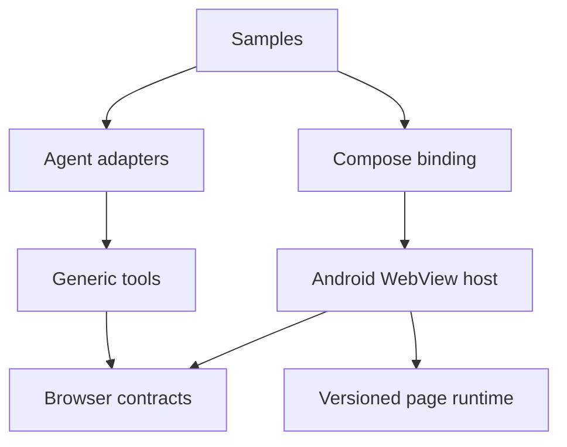

# Architecture

The system has one inward-pointing dependency graph:

`AgenticBrowserSession` is the only behavioral boundary exposed by the browser core. Its Android implementation serializes navigation and actions, owns a correlated runtime gateway, and publishes lifecycle state and typed events. A navigation creates a new document identity and cancels pending work for the previous document.

The TypeScript runtime observes semantic page structure and executes commands. It never receives arbitrary function names: Kotlin can call only registered protocol methods. Requests and responses carry protocol, session, document, and request identifiers.

Element identity is based on registered DOM object identity rather than selectors or content hashes. An `ElementRef` is valid only for its document and frame; replacement or detachment makes it stale.

See [the refactoring blueprint](architecture-refactoring-plan.md) and [ADR 0001](adr/0001-no-compatibility-rewrite.md) for decisions and rejected alternatives.
